# sakura2

<html lang="ja">
 <head>
  <meta charset="utf-8" />
	 

<link href="https://cdnjs.cloudflare.com/ajax/libs/lightbox2/2.7.1/css/lightbox.css" rel="stylesheet">
 
</head>
<body>

  モバイル端末をお使いの場合は、画面を横向きにすると
  より見やすくご覧頂けます。

<h1><marquee behavior="alternate">!!! Sakura in Japan 2021_Spring !!!</marquee></h1>	

                             
<!--

 アクセス用QRコード

-->
<h1><marquee behavior="alternate">!!! 2021_03_27、park !!!</marquee></h1>
<a href="20210327_001.JPG" data-lightbox="abc">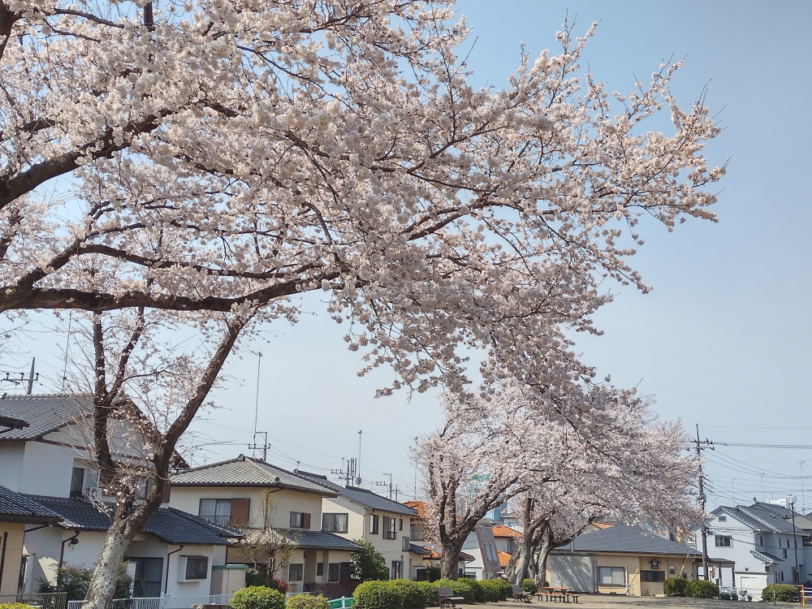</a>
<a href="20210327_002.JPG" data-lightbox="abc">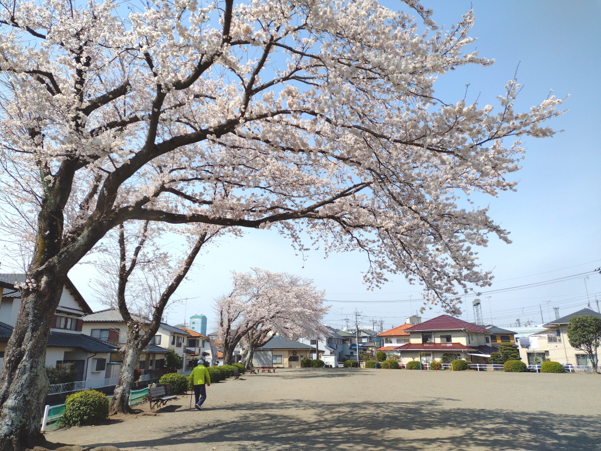</a>
<a href="20210327_003.JPG" data-lightbox="abc">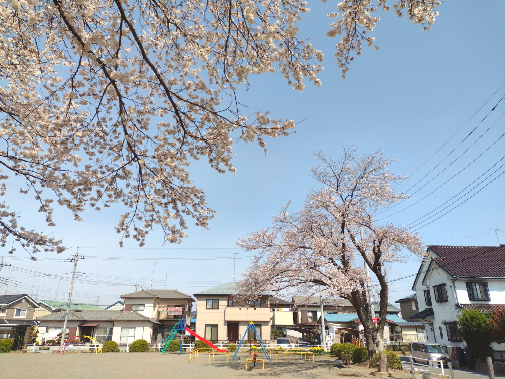</a>
<a href="20210327_004.JPG" data-lightbox="abc">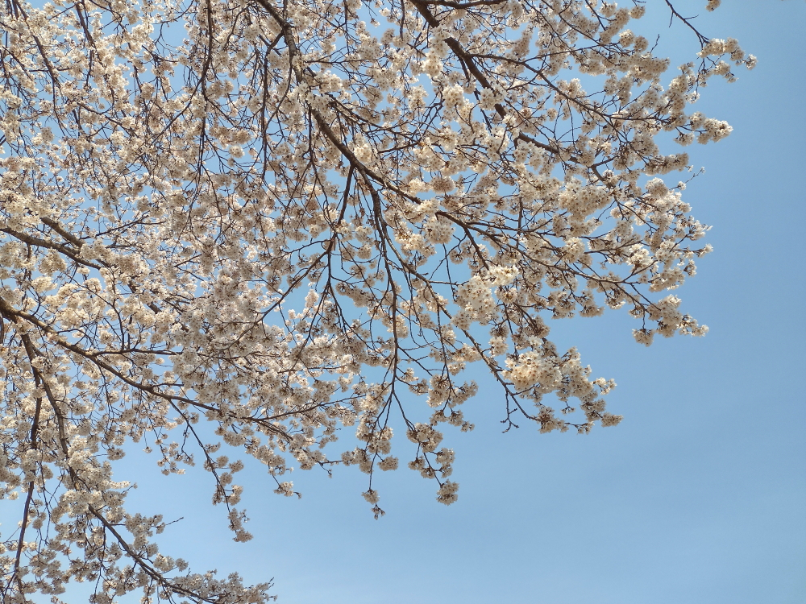</a>
<a href="20210327_005.JPG" data-lightbox="abc">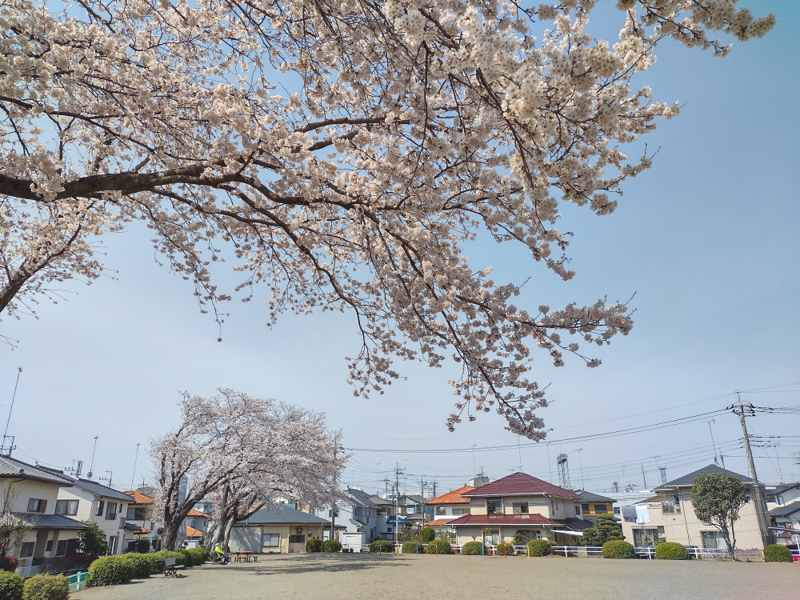</a>
<a href="20210327_006.JPG" data-lightbox="abc">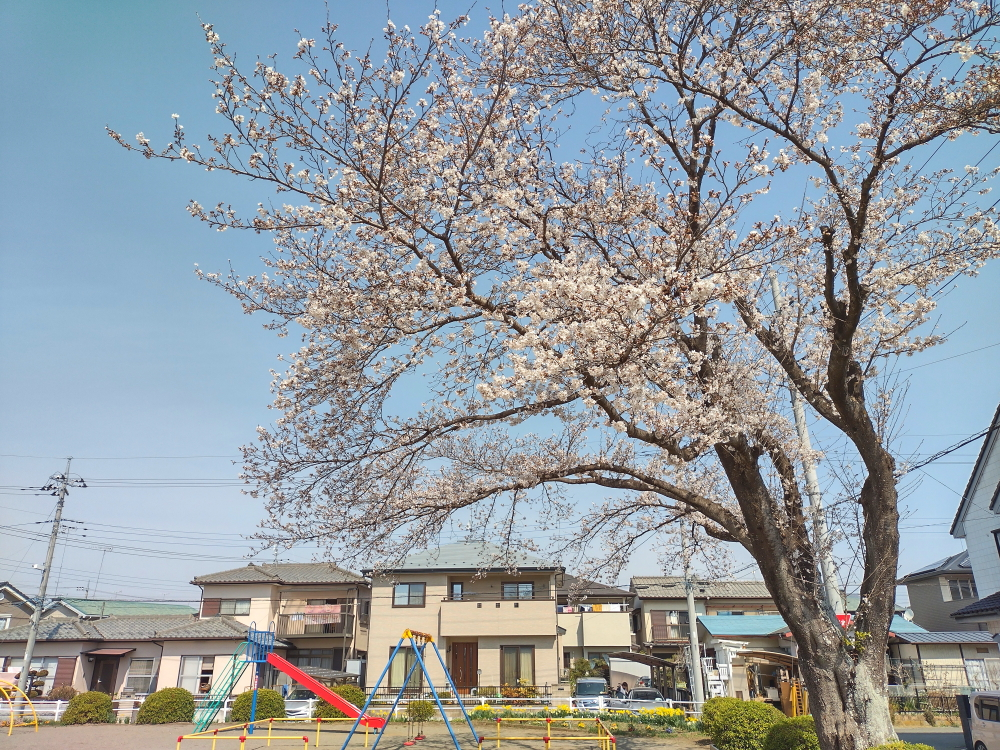</a>
<a href="20210327_007.JPG" data-lightbox="abc">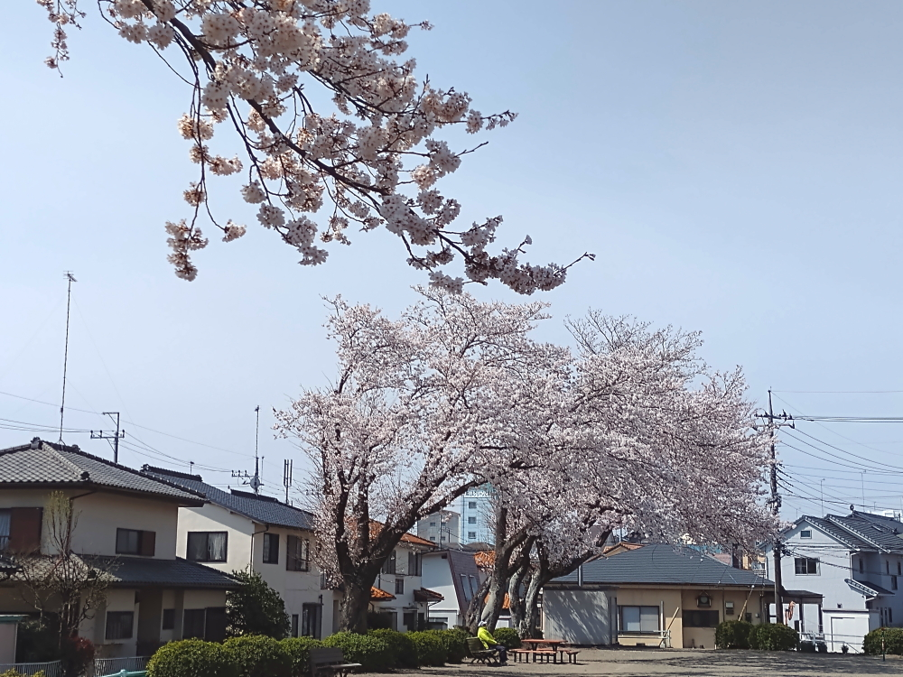</a>
<a href="20210327_008.JPG" data-lightbox="abc">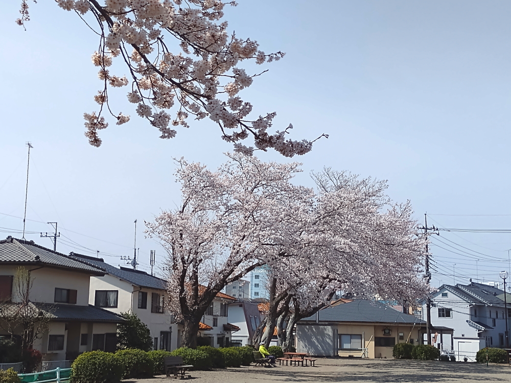</a>
<a href="20210327_009.JPG" data-lightbox="abc">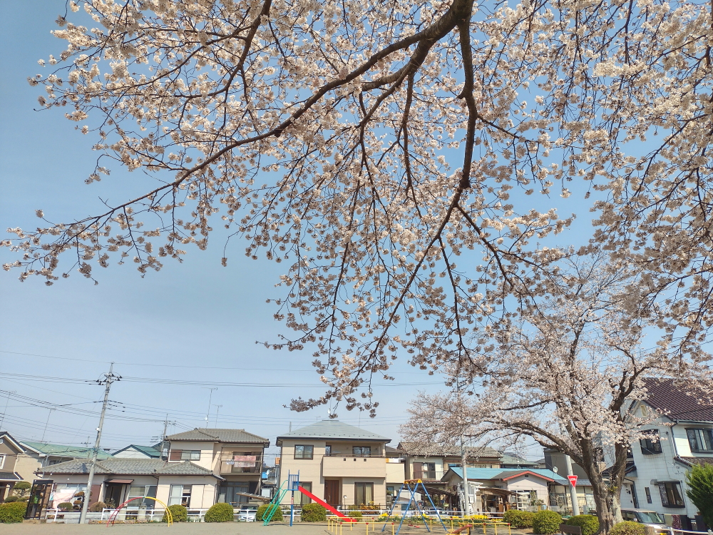</a>
<a href="20210327_010.JPG" data-lightbox="abc">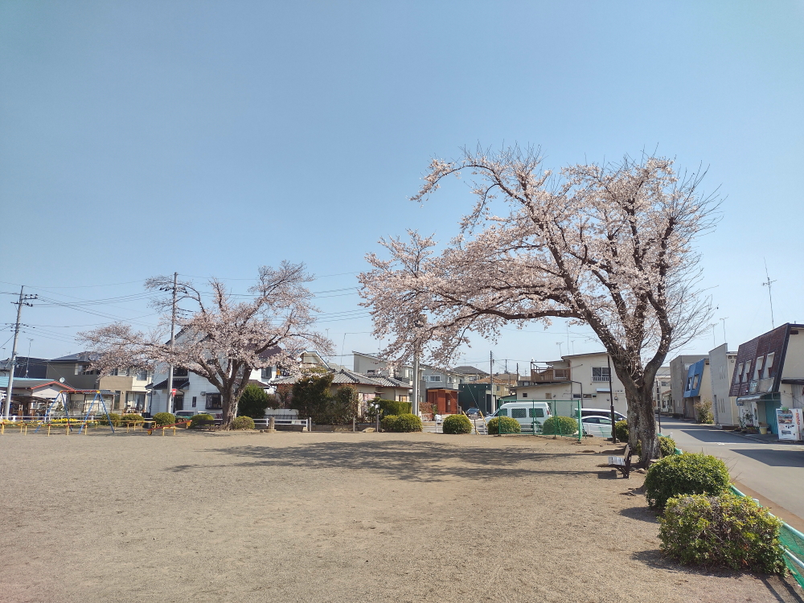</a>
<a href="20210327_011.JPG" data-lightbox="abc">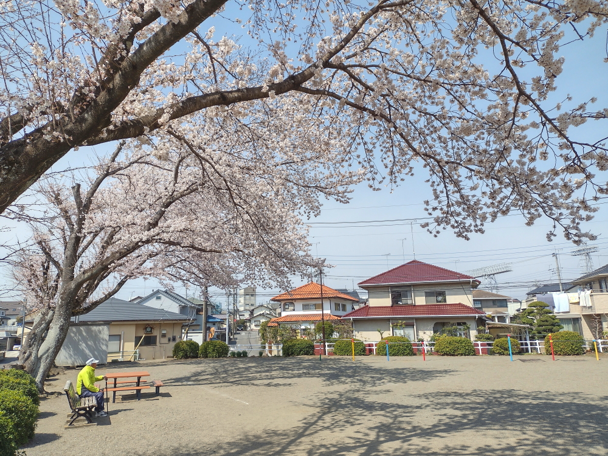</a>
<a href="20210327_012.JPG" data-lightbox="abc">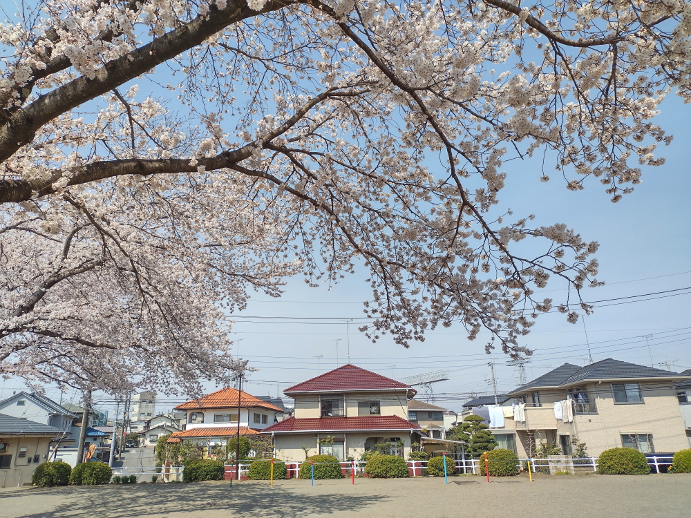</a>
<a href="20210327_013.JPG" data-lightbox="abc">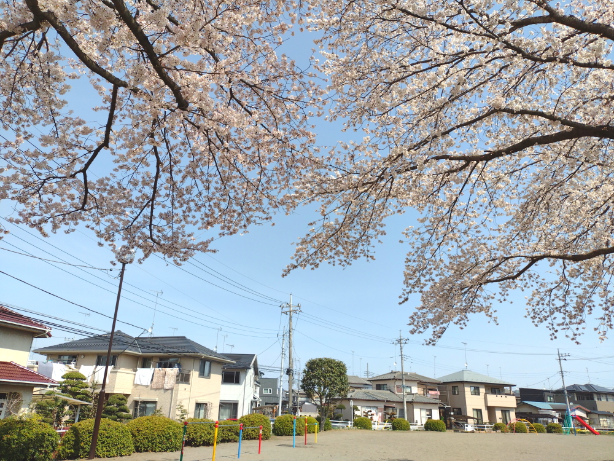</a>

<h1><marquee behavior="alternate">!!! 梅もまだまだ綺麗 !!!</marquee></h1>

                             

                  	
	
	

                   

 

</body>

<!-- フッタ -->
 <footer>
 Copyright 2020/04/05 S.Hada
	</footer>
